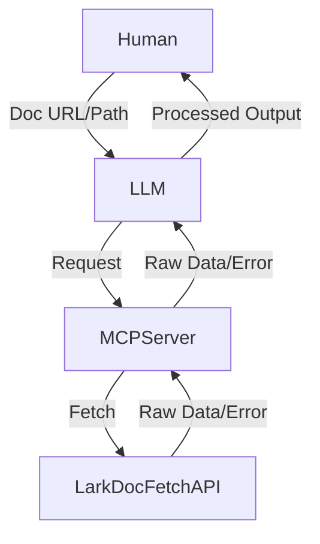

# Basic Specification: Lark API Documentation MCP Server

## 1. Purpose

The purpose of this system is to enable Large Language Models (LLMs) to efficiently and directly access Lark API documentation in a machine-readable format. The MCP server acts as a bridge, allowing LLMs to retrieve raw documentation data from the Lark Document Fetch API, which the LLM can then process and present to human users.

---

## 2. Scope

- The system is designed exclusively for LLM consumption; no direct human interaction with the MCP server is expected.
- The MCP server does not provide search, formatting, or transformation features. It simply proxies documentation data from the Lark Document Fetch API to the LLM.
- The system is agnostic to the structure of the returned documentation data and does not enforce or assume any schema.

---

## 3. Actors

- **LLM (Large Language Model):** The sole client of the MCP server. Receives requests from humans, interacts with the MCP server to fetch documentation data, and processes the results for human consumption.
- **Human User:** Interacts only with the LLM, providing documentation URLs or paths and receiving processed information.

---

## 4. Use Cases

### 4.1. Retrieve Documentation Data

- **Description:** The LLM receives a documentation URL or path from a human user, sends it to the MCP server, and receives the raw documentation data (e.g., JSON) from the Lark Document Fetch API. The LLM then processes and presents this information to the human user.

### 4.2. Error Handling

- **Description:** If the Lark Document Fetch API returns an error or is unreachable, the MCP server relays this error to the LLM, which then informs the human user appropriately.

---

## 5. System Overview

- The MCP server is accessed exclusively by the LLM.
- The LLM acts as the interface between human users and the MCP server.
- The MCP server proxies requests to the Lark Document Fetch API and returns the results unmodified.

### High-Level Workflow Diagram

---

## 6. Lark Doc API Overview

残念ながら検索機能はなかった。従って、人間様から、人間が見ているドキュメントの URL の提供を受け、そこからドキュメント API コールをし、その JSON を受け取るという形にするつもりだ。
なお、API の返却結果の型は分からない。従って、どのような JSON が返ってくるかは決め打ちせず、MCP としてはレスポンスを丸ごと返し、全てを LLM で処理するようにせよ。

人間用 URL: https://open.larksuite.com/document/uAjLw4CM/ukTMukTMukTM/group/im-v2/app_feed_card/create?appId=cli_a7f94cfb8bb8d02e

LLM 用 URL: https://open.larksuite.com/document_portal/v1/document/get_detail?fullPath=%2FuAjLw4CM%2FukTMukTMukTM%2Fgroup%2Fim-v2%2Fapp_feed_card%2Fcreate
