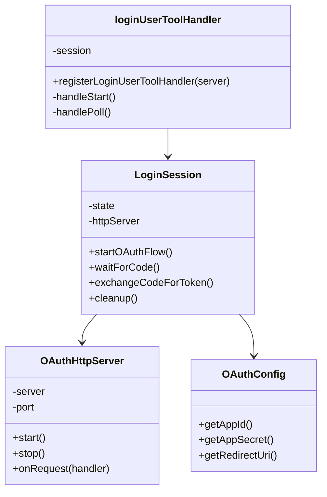

# loginUser.js リファクタリング設計案（サービス層分離・HTTP サーバークラス分離案）

---

## 1. 設計方針

- **可読性・保守性・LLM 親和性**: 小さく明確な関数、クラスによる状態管理、グローバル変数の排除、JSDoc コメント、エラー処理の一元化。
- **エンタープライズ/コンピュータサイエンティフィックな設計**: 状態遷移を明示するクラス設計、責務分離、拡張性重視。
- **tools ディレクトリの要件**: MCP サーバインスタンス（server 引数）を受け取るエクスポート関数で登録。
- **サービス層（service/）で純粋関数・純粋クラスを管理し、MCP ツール本体（tools/）と明確に分離する。**
- **HTTP サーバーの立ち上げ・停止・リクエスト処理は専用クラス（例: OAuthHttpServer）で分離し、LoginSession 等から委譲する。**

---

## 2. 新ファイル構成案

```
server/tools/
  loginUser.js                // MCPサーバ登録用エントリポイント（registerLoginUserTool(server)）
  fetchLarkDoc.js
  testLarkApi.js

server/service/loginUser/
  LoginSession.js           // OAuth状態・セッション管理クラス（純粋クラス、サーバ制御は委譲）
  OAuthConfig.js            // 環境変数・設定管理（純粋関数/クラス）
  oauthTokenExchange.js     // トークン交換ロジック（純粋関数）
  loginUserToolHandler.js   // MCPツールのstep分岐・レスポンス生成（純粋関数/クラス）
  OAuthHttpServer.js        // HTTPサーバーの起動・停止・リクエスト処理専用クラス
```

- `utils/waitSignal.js`はそのまま利用。

---

## 3. クラス・関数設計

### OAuthHttpServer（新設）

- HTTP サーバーの起動・停止・リクエストハンドリングを一元管理。
- `start()`, `stop()`, `onRequest(handler)` などのメソッド。
- LoginSession 等から委譲され、サーバーのライフサイクルを責任分離。

### LoginSession

- OAuth 認可フローの状態・セッション管理。
- サーバー制御は OAuthHttpServer に委譲。
- `startOAuthFlow()`, `waitForCode()`, `exchangeCodeForToken()`, `cleanup()` など。

### OAuthConfig

- app_id, app_secret, redirect_uri の取得・バリデーション。

### oauthTokenExchange

- 認可コード → アクセストークン交換の純粋関数。

### loginUserToolHandler

- MCP ツールの step（start/poll）分岐、LoginSession の状態遷移、レスポンス生成。

### loginUser.js

- `export function registerLoginUserTool(server)`のみをエクスポートし、内部で service 層のロジックを呼び出す。

---

## 4. 状態管理

- グローバル変数は廃止し、`LoginSession`のシングルトンインスタンスを`loginUserToolHandler`内で管理。
- `global.larkUserAccessToken`のみ、他ツールとの互換性のため維持（必要なら setter 経由で管理）。

---

## 5. MCP ツール登録例（loginUser.js）

```js
import { registerLoginUserToolHandler } from "../service/loginUser/loginUserToolHandler.js";

export function registerLoginUserTool(server) {
  registerLoginUserToolHandler(server);
}
```

---

## 6. Mermaid クラス図



---

## 7. 実装方針

- ES2020+、ESM 構成。
- MCP ツール登録関数は`server`引数を受ける（tools 直下のみ）。
- サービス層（service/）は純粋関数・純粋クラスとして設計し、server 引数は一切受け取らない。
- HTTP サーバーの責務は OAuthHttpServer クラスに集約。
- ファイル分割・クラス設計で責務を明確化。
- テストは後回し、コード構造に集中。

---

## 8. 受け渡し原則（最終確認用）

- **tools ディレクトリには MCP ツールのエントリポイントのみを置く。**
- **サービス層（service/）で純粋ロジック・状態管理・HTTP サーバー管理を行い、server 引数は受け取らない。**
- **責務分離・純粋性・テスト容易性を最優先し、必要な箇所だけが server 引数を受け取る。**
- **無理矢理 server 引数を受け取る設計は絶対にしない。**
